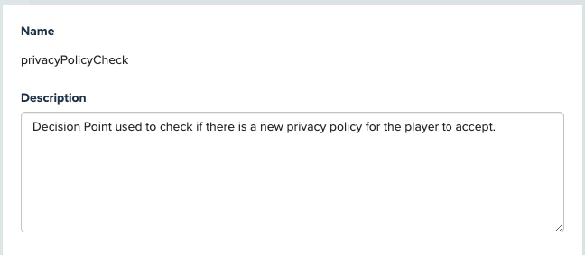
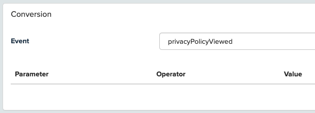

# tutorial-privacy-popup

## Introduction
This tutorial shows how to use a Decision Point Campaign to display a localized privacy policy to players when they first launch the game. A **privacyPolicyViewed** event is recorded to identify players that have seen the privacy policy and a **privacyPolicyTimestamp** metric is recorded in order to build a segment that could be used for re-targetting in the event of a policy update.

The output of this tutorial is a **Prefab** package that can be imported into an existing Unity project and used with minimal effort. 

## Using the Prefab 
The following steps show you how to use the privacy policy prefab in your own projects with minimal integration.

### Download the Privacy Policy Prefab
1 -  Download the latest Privacy Policy prefab file from the [Releases](releases) page. 

2 - Import it into your Unity project by selecting the Assets > Import Package > Custom Package option on the Unity Editor menu, then select the downloaded package file and import it. 

Alternatively, drag and drop the package file into the Prefabs folder in the Unity Editor Projects window.

3 -   Drag and Drop the Privacy Policy Prefab into your Scene. 

The privacy policy popup does require that you are using deltaDNA in your project, but other than that it is completely self contained. Each time the game is launched it will wait until the deltaDNA SDK is running then check the Decision Point campaign interface to see if it should download and display a Privacy Policy Popup. 

Naturally, the privacy policy prefab and the deltaDNA SDK should be added to a scene that is active as soon as practically possible after the app has loaded.. 

### Create a Decision Point
A [decision point](https://docs.deltadna.com/reference/setup/manage-decision-points/) is essentially a place in the game where you want to check to see if game should do something different from normal for the player at this specific point in time. 

The game will reach out to the deltaDNA server and anounce that it has this specific player at this point in the game, the server will then tell the game what to do. 

The response will be based on the [decision point campaigns](https://docs.deltadna.com/reference/engage/campaigns-3/create-campaign/) that are configured and active, their priorioty, the player's [segmentation](https://docs.deltadna.com/reference/analyze/segmentation-2/) based on current and historical data and any campaign logic defined in the campaign. 

So, to start with we need a decision point to say *"The player is here in the game"*

1 - Create a decision point called **privacyPolicyCheck** from the SETUP > Manage Decision Points menu in the DEV environment of your game in the [deltaDNA platform](https://deltadna.net). Then click the "Save" button

2 - Publish the decision point to your LIVE environment, until you do so it will only be available to campaigns on your DEV environment. 

### Creat an Event
The privacy policy prefab will record a **privacyPolicyViewed** event each time the privacy policy popup is shown to a player. But, the deltaDNA platform will reject it as an unknown event unless we create an event schema for it. 

1 - Create a new event called **privacyPolicyViewed** from the SETUP > Manage Events menu in the DEV environment of your game in the [deltaDNA platform](https://deltadna.net). 

2 - Add a new **privacyPolicyAccepted** parameter to the **eventParams** section of your new event. The parameter should be created as a **required** INTEGER parameter and you should set the Last, Max and Sum metrics to true.

This event parameter will allow you to identify if the player hit the accept button or simply dismissed the privacy policy popup.

3 - Add a new **privacyPolicyTimestamp** parameter to the **eventParams** section of your new event. The parameter should be created as a **required** TIMESTAMP parameter and you should set the First and Last metrics to true.

This event parameter will be stored as a metric and we will be able to use it on subsequent privacy policy update campaigns to target players who last saw the privacy policy before or after a particular date and time.

4 - As an optional step, you can delete the **userLevel, userScore** and **userXP** parameters from this event. They are optional parameters that won't be populated by the privacy policy popup code. Whether you leave them in or remove them will make no material difference, but youe event will look cleaner if you remove them. 

The final event should look like this. 

5 - Don't forget to "Save" your event.

6 - Publish the event to your LIVE environment, until you do so it will only be available in your DEV environment and any events sent to your LIVE environment will be rejected. 

### Create a "Privacy Policy Popup" Image Message
A localised [Image Message Action](https://docs.deltadna.com/reference/engage/actions/image-message-actions/) will be sent to the player and displayed as a popup image by the SDK. The contents of the popup will be based on the **userLocale** information their device revealed to the decision point campaign at runtime. 

The following image elements need to be supplied for each localised version of the popup
* A background grpahic containing the popup panel and any text
* A button graphic for the player to accept the popup
* *Optionally a close button to dimiss the popup* 

1 - Create a new **Image Message** Action called from the ENGAGE > In Game Actions  menu in the [deltaDNA platform](https://deltadna.net). 

2 - Set it to "Send image contents on everyEngage request" 
*This will make sure that the player will see the image message even if there is an issue downloading or displaying the image the first time around. Settings later on in the campaign will ensure they don't see it more than once.*

3 - Add the "Main Image" for your popup, this contains the background and default text to display. Set the behaviour of the Image to "Dismiss" if the user clicks on it. Then set the position and margin options.  

4 - Use the Localise button to add additional variants of the main image for each "Language" required. Repeat this step as necessary.

5 - Add a "Button" graphic and set it to have an Action called "Accept" when clicked

6 - Use the localise button to upload different language variant of your button graphic. Repeat this step for all language variants.

7 - *You can add an additional "Close" button if you want. If you do, set the Action behaviour on it to "Dismiss" if the player clicks it.*

8 - Drag any buttons in to position in the preview paneal and and check your popup looks OK.

9 - Set the Image Message background settings 

10 - Don't forget to "Save" your Image Message Action.

### Create a "Privacy Policy Popup" Decision Point Campaign
The privacy popup display will be controlled by a [Decision Point Campaign](https://docs.deltadna.com/reference/engage/campaigns-3/create-campaign/). The game will make a request to the specific decision point each time it launches, the decision point campaign engine will return the correctly localised image message if the player is elligable to see the popup at this precise time.

1 - Create a new **Decision Point Campaign** from the ENGAGE > In Game > Decision Point Campaigns menu in the [deltaDNA platform](https://deltadna.net). 

2 - Give your campaign a name and description

3 - If there are any other campaigns currently active on the same decision point you will beed to consider the Priority setting, else you can leave this at the default value. 

4 - Set the "Decision Point" to us the "Privacy Policy" decision point created earlier.

5 - Set the player segment that the campaign will target to "All Players"
. You can refine this if you only want to show the privacy policy popup to a subset of players. 

6 - The Start and End Date for the campaign can be set to specific dates if required, but in this example we will set the campaign to start immediately and run forever until we stop it. 

7 - Leave the AB Test switch set to "NO" unless you plan on testing different versions of your popup.

8 - Configure the content for "Action 1" to use the "Privacy Policy" Image Message Action setup earlier and set the "Final State" toggle switch to "YES" as we want to make sure the player exits the campaign after they have been shown the popup, they shouldn't see the popup multiple times. 

9 - Set the campaign conversion to use the "privacyPolicyViewed" events to measure the success of the campaign. 

10 - Save your campaign

11 - Navigate to the campaign conformation page, check your campaign details then click the "Launch" button, to start your campaign. 

Your campaign will be live within about 10 minutes and can be cecked on a device or using the [SETUP > Engage Trace Tool](https://docs.deltadna.com/reference/setup/engage-qa-testing/).

## Appendix 1 - Country based localisation.
This tutorial has used the "language" component of the **userLocale** parameter that the SDK populates and sends with each decision point request. You may have noticed that the Image Message Action localisation system also lets you use the "Territory" as a component. However we have not made use of this feature as the deltaDNA Unity SDK does not populate the Territory correctly. However, if you are using this technique with the deltaDNA iOS or Android SDKs the "Territory" option can be used successfully.

## Appendix 2 - Localised text rather than images.
This tutorial has relied on the localised text for the popup being burnt into the popup image. Whilst this requires the creation of indivdual images for each locale variant, it leaves the graphic designer in control of the final image. 

It would be possible to follow an alternate route and pass localised text to the game client as localised Game Parameters attached to an image message that contained just a single common image. The game client could then dynamically draw the text over the base image. 

However, this approach introduces a few additional complexities. 
* As well as sending the localised text as game parameters you will quickly realise that you may want to remotely configure the Title and Body text differently.
* You may want to remotely configure the Font, Font Size, Color, Alignment and Position with game parameters. 
* What about drop shadows, glows or other text effects
* And different locale versions of the text may be quite different lengths, so the font size and position may need to vary.

So, for simplicity and image quality reasons, this tutorial stops short of dynamically drawn text overlays.
